# Library Management System
## A Basic Library Management System Website with the help of Web Development

<h3>You can view the Software Requirement Specification(SRS) Document! at -> <a href="https://drive.google.com/file/d/1Py9VAFtkVKplEBBhxCFCuRG_f6-PMcXW/view?usp=sharing">Click Here</a></h3>

### Note :- Some Resources like image are taken from Internet , the aim of this project to apply my knowledge gain during learning from different resource , this project is not for commercial purpose . 

## Preview of the Project

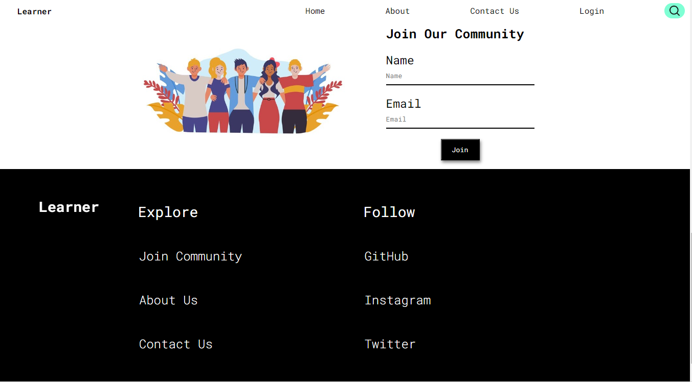

## Component Used

### HTML
HTML is used in the Project to Create the Basic Structure of the website like Navbar Footer and other Section all the component like image , Hyperlinks , Input Fields etc are added through HTML Tags

### CSS
All The styling portion , position adjustment , image adjustment are added though CSS , In the Project concept of adding the multiple stylesheet is used so that the __**Reusibility**__ of the same code can be done

#### Hovering Effect

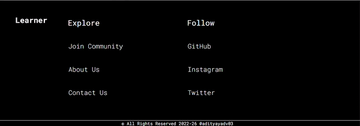

#### Responsive Design
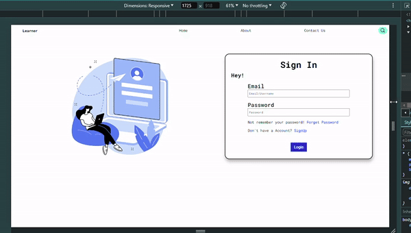

### JavaScript

JavaScript is used in the project to add multiple feature working like Book Issue Popups , Confirming Books Issue , Targeting Multiple Element using DOM , SignUp and SignIn Form Validation , SignUp Data Storing in LocalStorage

#### Element Manipulation Through DOM
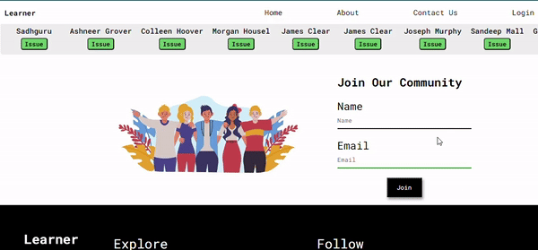

#### Form Validation

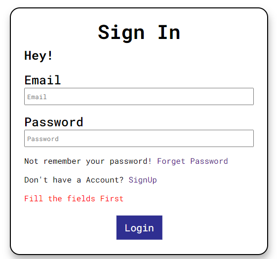
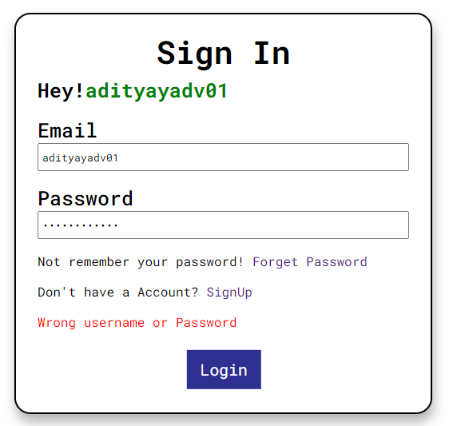
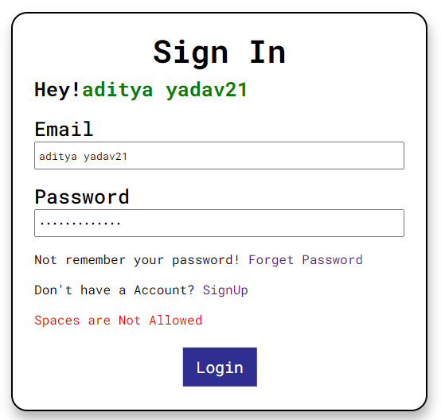
 
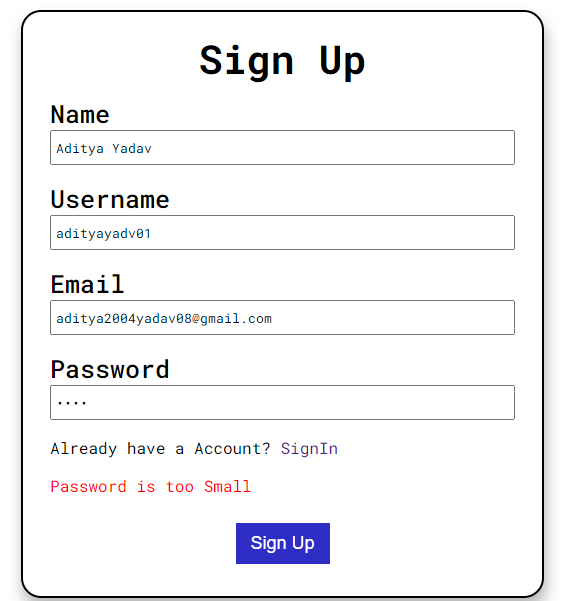
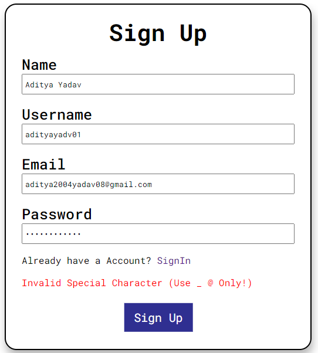

#### Credentials Saving in Local Storage
<ul>
    <li>Used LocalStorage of Browser to Save the SignUp Credentials and Then Using them to Login to the website.</li>
    <li>Signing Up</li>
    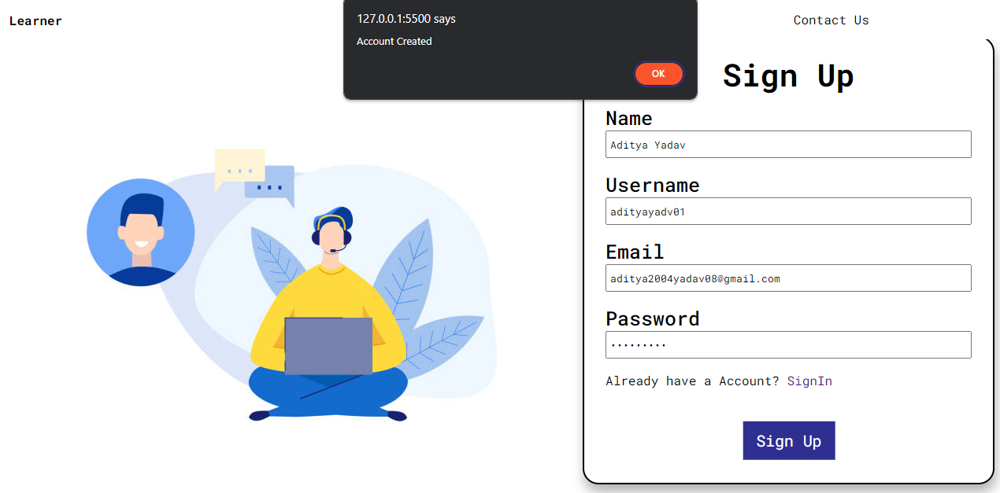
    <li>Data Stored in Local Storage</li>
    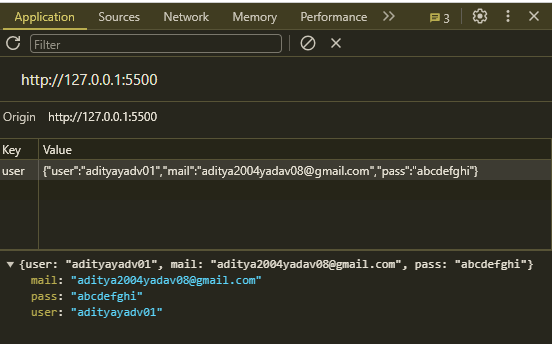
</ul>

### Angular JS

Angular JS Component is added in the project in the Sign In Page where when the Use types its username , The User will be greeted with a Hey! , this is done by angular without any backend or any other storage it is dynamic in Nature , In the Code I have used two ng Directive

1. **ngModel :- To bind the input field with vairable to display the greeting to the User using it .**
2. **ngStyle :- To Change the color of the variable used in the angular module .**

__**Preview**__
 
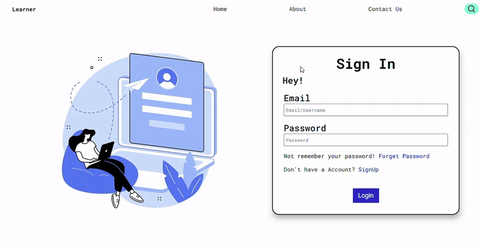

### Node JS

Node JS is Used in the project to create the server using two Modules 
1. **Fs Module :- For Reading and sending the file**
2. **Http Module :- To Create the server and send response accordingly to the request**

#### Code Preview
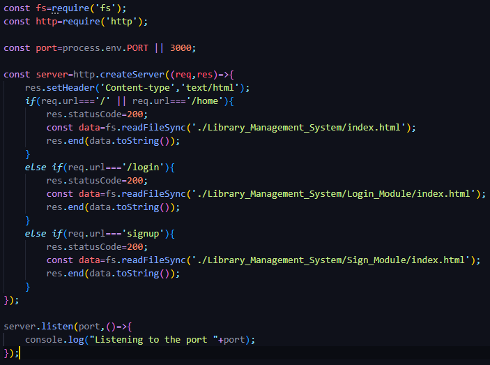

You can view the code Here! <a href="./webserver.js">Click Here</a>

